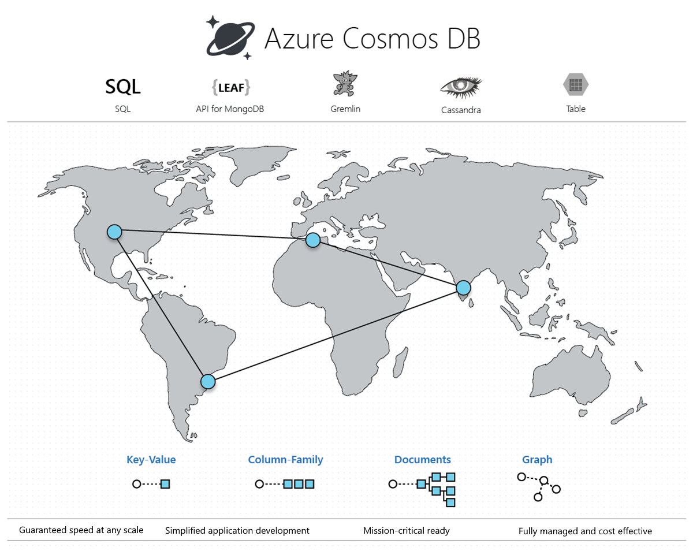

# CassandraAPICosmosDBHandsDirty

**Summary:**
This document provides guidance on getting your hands dirty using Azure Cosmos DB API for Cassandra Database.

## Introduction
Azure Cosmos DB Cassandra API can be used as the data store for apps written for [Apache Cassandra](https://cassandra.apache.org/_/index.html). This means that by using existing Apache drivers compliant with CQLv4, your existing Cassandra application can now communicate with the Azure Cosmos DB Cassandra API. In many cases, you can switch from using Apache Cassandra to using Azure Cosmos DB's Cassandra API, by just changing a connection string.

The Cassandra API enables you to interact with data stored in Azure Cosmos DB using the Cassandra Query Language (CQL) , Cassandra-based tools (like cqlsh) and Cassandra client drivers that you're already familiar with. For more information, visit the official Microsoft [documentation for Azure Cosmos DB API for Cassandra Database](https://docs.microsoft.com/en-us/azure/cosmos-db/cassandra/cassandra-introduction).

## About Azure Cosmos DB
Azure Cosmos DB is a fully managed NoSQL database for modern app development, with SLA-backed speed and availability, automatic and instant scalability, and open-source APIs for MongoDB, Cassandra, and other NoSQL engines. For a more in-depth coverage of Azure Cosmos DB, you should visit the official site here > https://docs.microsoft.com/en-us/azure/cosmos-db/introduction

## Getting Started
If you're looking to get started quickly, you can find a range of SDK Support and sample Tutorials using .NET, .NET Core, Java, Python etc. [here](https://docs.microsoft.com/en-us/azure/cosmos-db/cassandra/manage-data-dotnet).

## Running this Sample
This sample is in .NET. For running this sample, all you need to do is to download the Solution Project file; and then make the following changes as mentioned below.

## What you need for this Sample?
You need an Azure subscription, a working Azure Cosmos DB Account with Cassandra API created, and working knowledge of both Apache Cassandra contructs, queries & limitations, and programming in .NET. It is assumed that you possess all these for enjoying and doing further R&D on this sample. Simply clone this git repo (or download as Zip).

## A few things to do before deep-dive:
1. 
