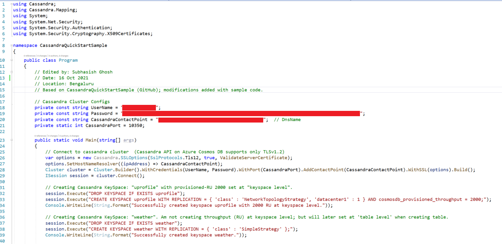
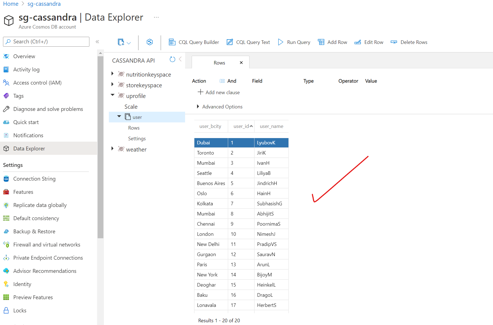
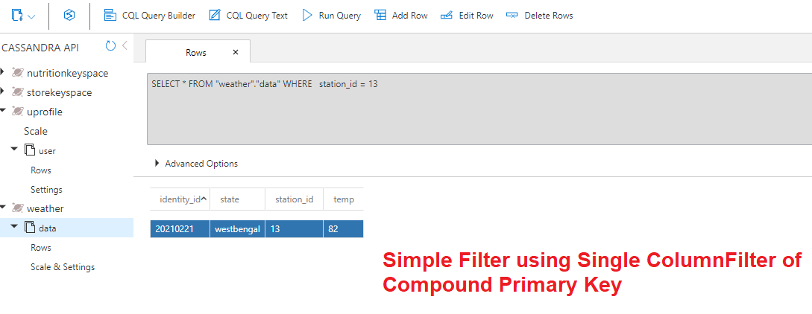
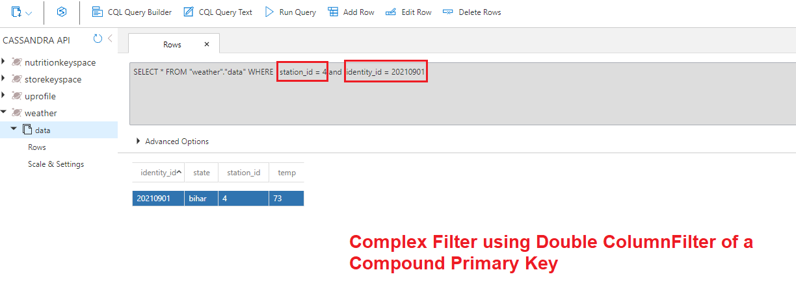

# Getting-Hands-Dirty-CassandraAPI-CosmosDB

**Summary:**
This document provides guidance on getting your hands dirty using Azure Cosmos DB API for Apache Cassandra Database.


# Contents

[Introduction](#Introduction)

[About Azure Cosmos DB](#about-azure-cosmos-db) 

[Getting Started](#getting-started)

[What you learn from this Sample](#what-you-learn-from-this-sample)

[Core Differences between Apache Cassandra and Azure Cosmos DB API for Cassandra](#core-differences-between-apache-cassandra-and-azure-cosmos-db-api-for-cassandra)

[Running this Sample](#running-this-sample)

[What you need for this Sample?](#what-you-need-for-this-sample)

[A few things to do before deep-dive](#a-few-things-to-do-before-deep-dive)

[Output in VS](#output-in-vs)

[Validate in Azure Portal](#validate-in-azure-portal)

[Home Work](#home-work)

[Feedback](#feedback)

[License/Terms of Use](#license--terms-of-use)

## Introduction
Azure Cosmos DB Cassandra API can be used as the data store for apps written for [Apache Cassandra](https://cassandra.apache.org/_/index.html). This means that by using existing Apache drivers compliant with CQLv4, your existing Cassandra application can now communicate with the Azure Cosmos DB Cassandra API. In many cases, you can switch from using Apache Cassandra to using Azure Cosmos DB's Cassandra API, by just changing a connection string.

The Cassandra API enables you to interact with data stored in Azure Cosmos DB using the Cassandra Query Language (CQL) , Cassandra-based tools (like cqlsh) and Cassandra client drivers that you're already familiar with. For more information, visit the official Microsoft [documentation for Azure Cosmos DB API for Cassandra Database](https://docs.microsoft.com/en-us/azure/cosmos-db/cassandra/cassandra-introduction).

## About Azure Cosmos DB
Azure Cosmos DB is a fully managed NoSQL database for modern app development, with SLA-backed speed and availability, automatic and instant scalability, and open-source APIs for MongoDB, Cassandra, and other NoSQL engines. For a more in-depth coverage of Azure Cosmos DB, you should visit the official site here > https://docs.microsoft.com/en-us/azure/cosmos-db/introduction


## Getting Started
If you're looking to get started quickly, you can find a range of SDK Support and sample Tutorials using .NET, .NET Core, Java, Python etc. [here](https://docs.microsoft.com/en-us/azure/cosmos-db/cassandra/manage-data-dotnet).

## What you learn from this Sample?
Key learning include:
- Creating an Apache Cassandra Keyspace in Azure Cosmos DB using API for Cassandra leveraging C#.
- Providing provisioned throughput (RU) at Keyspace level.
- Creating an Apache Cassandra Table in Azure Cosmos DB using API for Cassandra.
- Providing provisioned throughput (RU) at table level.
- Best practices for creating a Primary Key in Cassandra (which includes 1 partitionKey + 0 or more Clustering Columns).
- Creating a table with a single Primary Key.
- Creating a table with a *Compound* Primary Key for a use-case wherein a single Primary Key will not work.
- Inserting data into both tables: uprofile.user and weather.data.
- Query operations using a simple filter across a Single Primary Key.
- Query operations using a simple filter across a Compound Primary Key.
- Query operations using a complex filter across a Compound Primary Key.
- Query Operation trying to query table by filtering by non-primary key. Flags an error which is as per Cassandra Database Guidelines.
- Calculating Request Unit (throughput) in Azure Cosmos DB API for Cassandra via .NET SDK for different operations.
- HOME WORK - To explore 2 possible solutions to solve the above problem.
- HOME WORK - To explore increasing Cardinality of the weather.data table by replacing 'identity_id' with [Cassandra timestamp data type](https://docs.datastax.com/en/cql-oss/3.x/cql/cql_reference/timestamp_type_r.html).

## Core Differences between Apache Cassandra and Azure Cosmos DB API for Cassandra
There's some inherent differences 'Architecturally', 'Conceptually' and 'Realistically' that you must be aware of for using the Azure Cosmos DB API for Cassandra. The core differences have been outlined in the **Comments** section in Visual Studio Solution Program.cs file in this repo. Mentioning it once again for relevance.

1. The Azure Cosmos DB Cassandra API is compatible with CQL v3.11 API (backward-compatible with version 2.x).
   Read more > https://docs.microsoft.com/en-us/azure/cosmos-db/cassandra/cassandra-support#cassandra-protocol
            
2. Size limits:
* total size of data stored in a table on Cosmos = NONE. RULE is: Add TB/PBs of data as long as 'partitionKey' size limits are respected.
* total data size of entity (row) should not exceed 2MB.
* total data size of a single partitionKey cannot exceed 20GB.
            
3. In OSS/DataStax, at Keyspace creation level, you can choose options: replica replacement strategy (SimpleStrategy, NetworkTopologyStrategy), replication factor & durable writes setting.
```
CREATE KEYSPACE uprofile WITH REPLICATION = { 'class' : 'NetworkTopologyStrategy', 'datacenter1' : 1 }   
```
In Cosmos, all options are ignored currently (class, replicationstrategy, replicationfactor, datacenter).
What Cosmos does is:
* Cosmos uses the underlying Global distribution replication method to add the regions.
  * If you need the cross-region, need to do at account level with PowerShell, CLI, or Azure portal.
* Durable_writes can't be disabled because Azure Cosmos DB ensures every write is durable.
* In every region, Cosmos replicates the data across the replica set that is made up of four replicas and this replica set configuration can't be modified.

4. In Cosmos, throughput (RU) can be set both at Keyspace and Table level.
```
CREATE KEYSPACE  sampleks WITH REPLICATION = {  'class' : 'SimpleStrategy'} AND cosmosdb_provisioned_throughput=2000;
CREATE TABLE sampleks.t1 (user_id int PRIMARY KEY, lastname text) WITH cosmosdb_provisioned_throughput=2000;
```

5. In OSS/DataStax, recommended PrimaryKey (partitionKey) should be < 100MB-limit. 
   In Cosmos, single partitionKey size can be of limit 20GB (per logical partition), 30GB (per physical partition). Each PPartition = 10,000 RUs.
   
6. In OSS/DataStax, Cassandra a replication factor is mentioned during creation time; e.g. 1.
   In Cosmos, there is (by default) a replication factor = 4 (quorum of 3). Microsoft manages replica sets, you can sleep nicely at night.
            
7. In OSS/DataStax, Cassandra has an important concept of tokens (# of partitionKey(fx)). TokenRing = murmur3 64 byte hash, with values ranging from -2^63 to -2^63 - 1.
   In Cosmos, we use a similar concept, but we use a different # token, and token ring range is different internally (larger), but externally same.
            
8. Difference in CQL Functions:
* Cosmos supports token as a projection/selector, and only allows token(pk) on the left-hand side of a where clause. 
```
WHERE token(pk) > 1024 is OK.
```
```
WHERE token(pk) > token(100) is **not** supported.
```
* The cast() function is not nestable in Cassandra API.
```
SELECT cast(count as double) FROM myTable is supported.
```
```
SELECT avg(cast(count as double)) FROM myTable is **not** supported.
```
* Custom timestamps and TTL specified with the USING option are applied at a row level (and not per cell).
* Aggregate functions work on regular columns, but aggregates on clustering columns are not supported.
  Read more > https://docs.microsoft.com/en-us/azure/cosmos-db/cassandra/cassandra-support#cql-functions

9. Specifics around difference between OSS & Cosmos DB API CQL commands > https://docs.microsoft.com/en-us/azure/cosmos-db/cassandra/cassandra-support#cql-commands

10. In Cosmos, all attributes are 'Indexed' by Default for all APIs (e.g. Core SQL API). Cassandra API does *not* work in the same manner.
    In other words, Cassandra API does **not** index all attributes by default. Cassandra supports 'Secondary Indexing'.
    Read more > https://docs.microsoft.com/en-us/azure/cosmos-db/cassandra/secondary-indexing
    
11. In Cosmos, filtering a Q against a non-PrimaryKey is **not** allowed (as per Cassandra best practices). 
    See code to fix it either by creating 'Secondary Index' OR 'ALLOW FILTERING'.
            
12. Cassandra API on Azure Cosmos DB supports only TLSv1.2

13. An in-depth difference between OSS/DataStax Cassandra Consistency Level and Cosmos DB Cassandra API Consistency Levels.
    Read more > https://docs.microsoft.com/en-us/azure/cosmos-db/cassandra/apache-cassandra-consistency-mapping#mapping-consistency-levels

## Running this Sample
This sample is in .NET. For running this sample, all you need to do is to download the Visual Studio Solution file; and then make the following changes as mentioned below. You can also leverage this GitHub repo for getting up and running quickly > https://github.com/Azure-Samples/azure-cosmos-db-cassandra-dotnet-core-getting-started.

## What you need for this Sample?
You need the following:
- An Azure subscription. If you do not have one, you can get a *free* one [here](https://azure.microsoft.com/en-in/free/) with USD 200 Credit.
- Working Azure Cosmos DB Account with Cassandra API. Learn how to create one using Azure portal [here](https://docs.microsoft.com/en-us/azure/cosmos-db/cassandra/manage-data-dotnet) using this Tutorial.
- Visual Studio Code / Visual Studio 2019 or similar IDE. You can download your VS [here](https://visualstudio.microsoft.com/downloads/).
- Working knowledge of both Apache Cassandra contructs, queries & limitations.
- Working knowledge of programming in .NET.
It is assumed that you possess all these for enjoying and doing further R&D on this sample. Simply clone this git repo (or download as Zip).

## A few things to do before deep-dive
1. Open the Visual Studio Solution file; ensure your Nuget packages are upto date. Specifically, ensure that '[CassandraCSharpDriver](https://www.nuget.org/packages/CassandraCSharpDriver/)' is installed. Your packages.config file should resemble the same as shown below:


2.In the Program.cs file, edit the secion below. You will find these from your Azure portal, Cosmos DB account's Settings > Connection String:



```
// Cassandra Cluster configs section.
private const string UserName = "<< ENTER YOUR USERNAME >>"; 
private const string Password = "<< ENTER YOUR PRIMARY PASSWORD >>";
private const string CassandraContactPoint = "<< ENTER YOUR CONTACT POINT >>";  // DnsName
private static int CassandraPort = 10350;                                       // Leave this as it is
```

## Output in VS

- Once run successfully, the program should run to create 2 Keyspaces and 2 Tables respectively in each Keyspace.
- Next, it will also load data into the corresponding tables with the Keys that have been created.
- Keyspace 'uprofile' has table user with a single PrimaryKey; keyspace 'weather' has table data with a Compound PrimaryKey.
- At this stage, you can pause to take a look at your resources in the Azure portal.


- When you perform operations against the Azure Cosmos DB Cassandra API, the RU charge is returned in the incoming payload as a field named RequestCharge. In .NET SDK, you can retrieve the incoming payload under the Info property of a RowSet object. You can perform Operations and test RU on VS console.


- Finally, proceed in Visual Studio to test Basic Query Operations on Keyspaces and Tables created in the earlier steps. Finally, we perform a filter operation against weather.data table using a simple filter from a Compound Primary Key which retrieves us a result.


## Validate in Azure Portal

In the Azure portal, you should find screens similar to these and do further R&D in Data Explorer.

- 2 Keyspaces and 2 Tables created. One with Shared Keyspace-level RU, and one with Provisioned Table-level RU.


- All data correctly loaded into Table 'uprofile.user'.


- Use the **CQL Query Builder** & **CQL Query Text** in Data Explorer, to query table uprofile.user with a simple filter (e.g. user_id = 7).


- All data correctly loaded into Table 'weather.data'.


- Use the **CQL Query Builder** & **CQL Query Text** in Data Explorer, to query table weather.data with a simple filter. Please note that this table has a **Compound** Primary Key (station_id, identity_id). First, we filter against 'station_id' = station_13. The result is as expected and the row is extracted from the database.


- Next, we use the **CQL Query Builder** & **CQL Query Text** in Data Explorer, to query table weather.data with a complex filter. Please note that this table has a **Compound** Primary Key (station_id, identity_id). We now filter against 'station_id' = station_4 & 'identity_id' = 20210901 which represents our 'Noida' Weather Station in our dataset. The result is as expected and the row is extracted from the database.


- Next, we use the **CQL Query Builder** & **CQL Query Text** in Data Explorer, to query table weather.data with a Non-Primary Key filter. Please note that this table has a **Compound** Primary Key (station_id, identity_id). We now filter against 'temp' = 74. The result is as expected: An Error is thrown which says, 
```
{"readyState":4,"responseText":"\"{\\\"message\\\":\\\"Cannot execute this query as it might involve data filtering and thus may have unpredictable performance. If you want to execute this query despite the performance unpredictability, use ALLOW FILTERING\\\",\\\"activityId\\\":\\\"3b810dcd-ce7d-4483-9d43-51040f7103b5\\\"}\"","responseJSON":"{\"message\":\"Cannot execute this query as it might involve data filtering and thus may have unpredictable performance. If you want to execute this query despite the performance unpredictability, use ALLOW FILTERING\",\"activityId\":\"3b810dcd-ce7d-4483-9d43-51040f7103b5\"}","status":500,"statusText":"error"}
```
In short, you cannot filter and execute a query against a Non-Primary Key in Apache Cassandra and the same holds true even if you're using Azure Cosmos DB's API for Cassandra Database.


- The same you can capture as an Error when executed in Visual Studio. I try executing a similar Query from .NET SDK, and it exits with an Error which reads the same.


## Home Work
If you have reached thus far, give yourself a well deserved applause and a coffee break!
You can extend the sample and try and find out how you could solve the above mentioned error.

1) **Solving Error**: HINT: There are 2 possible solutions to the above:
- Option #1: Add "ALLOW FILTERING" to the query which then solves the problem. Note: This is not a recommended option since this can cause a poor performance on massively large datasets. In fact, for supremely fast query read/write performance on Cassandra, it is highly recommended to build a correct Data Model justifying your use-case and having 1 highly optimized keyspace.table per query. Read this document as good guidance from the DataStax team: https://www.datastax.com/blog/allow-filtering-explained

- Option #2:  In Azure Cosmos DB Cassandra API, you can choose which specific attributes you want to Index; this is called '[Concept of Secondary Indexes](https://docs.microsoft.com/en-us/azure/cosmos-db/cassandra/secondary-indexing)'. You can thereby create a Secondary Index and this will allow the query to run.
Code to use: 

```
CREATE INDEX ON weather.data (state);
describe table weather.data;
```

2) **Increasing Cardinality of weather.data table**. During creation of the data table, we use:
```
session.Execute("CREATE TABLE IF NOT EXISTS weather.data (station_id int, identity_id int, temp int, state text, PRIMARY KEY (station_id, identity_id)) WITH cosmosdb_provisioned_throughput = 4000 AND CLUSTERING ORDER BY (identity_id DESC)");
```
You can replace identity_id with a timestamp data type variable; e.g. ts as well. For real-life large dataset projects, it is recommended to use [Cassandra UUID & timeuuid functions](https://docs.datastax.com/en/cql-oss/3.3/cql/cql_reference/timeuuid_functions_r.html).
```
session.Execute("CREATE TABLE IF NOT EXISTS weather.data (station_id int, ts timestamp, temp int, state text, PRIMARY KEY (station_id, identity_id)) WITH cosmosdb_provisioned_throughput = 4000 AND CLUSTERING ORDER BY (ts DESC)");
```

## Feedback
You can share any feedback at: sugh AT microsoft dot com

## License & Terms of Use
This is a free white paper released into the public domain. Anyone is free to use or distribute this white paper, for any purpose, commercial or non-commercial, and by any means. Same applies to the code in the repo.

THE WHITE PAPER IS PROVIDED "AS IS", WITHOUT WARRANTY OF ANY KIND, EXPRESS OR IMPLIED, INCLUDING BUT NOT LIMITED TO THE WARRANTIES OF MERCHANTABILITY, FITNESS FOR A PARTICULAR PURPOSE AND NONINFRINGEMENT.

IN NO EVENT SHALL THE AUTHORS BE LIABLE FOR ANY CLAIM, DAMAGES OR OTHER LIABILITY, WHETHER IN AN ACTION OF CONTRACT, TORT OR OTHERWISE, ARISING FROM, OUT OF OR IN CONNECTION WITH THE WHITE PAPER.

Have fun & happy coding!
